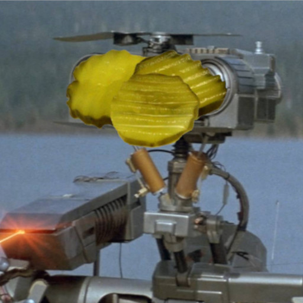

# Pickle Bot



A Discord bot to handle pickleball-related needs

## Setup

The `BOT_TOKEN` environment variable must be set to your bot token.
The `BOT_LOG_LEVEL` enivornment variable can be set to a typical log level to control logging.
Values can be specified through a `.env` file.

## Usage

### With Docker

```
docker compose up
```

### Without Docker

```
poetry install
poetry run bot  
```
